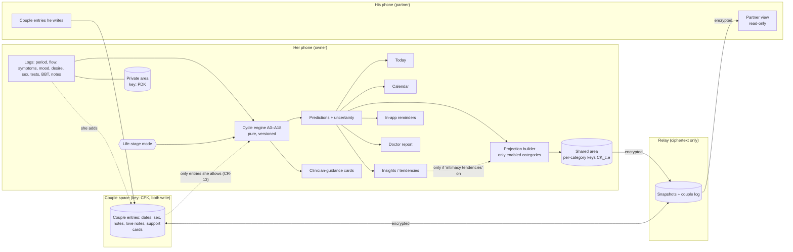
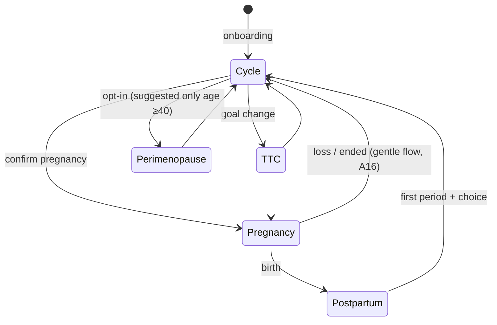

# Architecture (Step 4)

**Status:** Stage C draft, 2026-10-02. This is a design, not a tested system. All device and provider capabilities marked **untested** need a Phase 0 feasibility check ([roadmap.md](roadmap.md#p0--foundation)). The storage, sync, hosting and notification choice is in [storage-sync-decision.md](storage-sync-decision.md). The key hierarchy and threat model are in [security-privacy.md](security-privacy.md). ADRs: [docs/adr/](../adr/README.md).

## 1. How everything ties together



**Life-stage modes.** Modes are local to her phone. Her current mode is shared only if she enables the `life_stage` category ([consent rule CR-09](security-privacy.md#2-consent-and-privacy-rules-testable)).



| Mode | What changes |
|---|---|
| Cycle (default) | Period prediction (A2); fertile estimate (A4) unless suppressed; pregnancy-chance category (A5); tendencies (A12); cycle cards |
| TTC | Same engine. Copy focuses on conception timing and the "Higher" days. Test-timing and prenatal-vitamin reminders. A disclaimer remains |
| Pregnancy | Period and fertility predictions suppressed. Dating (A10). Weekly original content, checklists, pregnancy symptoms. BBT/LH logging hidden (Flo documented) |
| Postpartum | Predictions suspended until the first period (A16). Lochia logging. A "pregnancy possible before first period" card |
| Perimenopause | Wider windows. Signals (A14). Impact summary. Hot flush and sleep trackers prominent |

## 2. Stack and why

All choices are recorded in [ADR-0001](../adr/0001-stack-typescript-preact-vite.md). Every version is pinned exactly in Phase 0 after checking its licence, its maintenance and `npm audit`. **No versions are installed during planning.**

| Concern | Choice | Why (alternatives) |
|---|---|---|
| Language | TypeScript, `strict: true`, `noUncheckedIndexedAccess` | Required by constitution rule 9 |
| UI | **Preact** + `@preact/signals` | React-compatible mental model and large documentation base, at a ~4 KB runtime, which helps the iPhone startup budget. React adds about 40 KB; Svelte is fine but less mainstream for hiring help and docs. **DESIGN** |
| Build | Vite | Mainstream; fast; static output for any host |
| Local DB | IndexedDB through `idb` (small promise wrapper, ISC licence, to verify) | IndexedDB is shipped and documented (R4 §2). OPFS is kept for backup staging only, if needed |
| Crypto | **WebCrypto only** (AES-GCM, HKDF, PBKDF2, ECDH P-256, ECDSA P-256) | No crypto dependency. P-256 rather than X25519 for broad support. MDN documents X25519 in `deriveKey` (https://developer.mozilla.org/en-US/docs/Web/API/SubtleCrypto/deriveKey, accessed 2026-10-02; Documented, high), but Safari support is **untested** here |
| QR | Display: a small QR encoder (e.g. `qrcode-generator`, MIT). Scan: camera through `getUserMedia` plus `jsQR` (Apache-2.0) | Native `BarcodeDetector` support in Safari is **untested**. Fallback: a typed or AirDropped pairing code |
| Service worker | Hand-written TypeScript SW with a build-generated precache manifest | Full control over update safety (§7). Avoids Workbox's added complexity |
| PDF report | Print-optimized HTML route, then iOS "Print → Save PDF" or the share sheet | No PDF library |
| Relay (P2) | Cloudflare Worker (TypeScript) + D1, no framework | See [storage-sync-decision.md](storage-sync-decision.md) |
| Tests | Vitest, `fast-check` (property tests), Playwright WebKit with iPhone device descriptors, `@axe-core/playwright` | [test-strategy.md](test-strategy.md) |
| Lint/format | ESLint (typescript-eslint) + Prettier | Mainstream |

**Dependency budget.** Runtime dependencies are limited to `preact`, `@preact/signals`, `idb`, a QR encoder and `jsqr`. Each runtime dependency added later needs an ADR.

## 3. Module boundaries and contracts (contracts first)

All interfaces live in `src/contracts/` (task `p0-contracts`). They are versioned. A change to a contract needs an ADR and a foundation task. Modules depend only on contracts, never on each other's internals.

| Module (path) | Responsibility | Key interface (in `src/contracts/`) | Depends on |
|---|---|---|---|
| `lib/localdate` | A0 date arithmetic | `LocalDate`, `epochDay`, `addDays`, `diffDays`, `todayLocal()` | — |
| `crypto` | Primitives, key hierarchy, envelopes | `CryptoApi`: `deriveKek`, `wrapKey`, `unwrapKey`, `seal`, `open`, `sign`, `verify`, `ecdhWrap`, `ecdhUnwrap` | localdate |
| `data` | Encrypted IndexedDB store, migrations, repositories | `RecordStore`: `get/put/delete/list(type)`, `transaction`; `Migrations`; `LogRepo`, `SettingsRepo` | crypto, contracts |
| `lock` | Passphrase setup, unlock, auto-lock, passkey PRF, quick-hide | `LockService`: `setup`, `unlock`, `lock`, `isUnlocked`, `onLock` | crypto, data |
| `engine` | A0–A18 (pure) | `runEngine(input, params)` | localdate only |
| `share` | Categories, projections, epochs, key wrapping for the partner | `ShareService`: `enable`, `pause`, `resume`, `revoke`, `preview`, `buildProjection` | crypto, data, engine output types |
| `pairing` | QR exchange, safety code, device registration, unpair | `PairingService` | crypto, share, sync |
| `sync` | HLC, outbox/inbox, merge, transports | `SyncTransport` (`relay`, `file`), `SyncEngine` | crypto, data |
| `couple` | Couple entries, love notes, support cards | `CoupleRepo` | data, sync |
| `backup` | JSON/CSV export/import, encrypted backup and restore, recovery code | `BackupService` | crypto, data |
| `reminders` | In-app evaluation; push subscription | `ReminderService` | engine output, data |
| `content` | Original cards, sources, selection (A17) | `ContentIndex` | — |
| `ui` | Screens and components; design tokens | Props typed from contracts | all of the above, through app state only |
| `app` | Routing, composition, state wiring | — | everything (integration-only files) |
| `relay/` | Worker: signed requests, snapshots, couple log, cron push | HTTP API spec in [storage-sync-decision.md §5](storage-sync-decision.md#5-relay-protocol-summary) | — |

**Ownership rule for parallel waves.** Only `app` integration tasks may edit `src/app/**`. Screen tasks own only their own screen folders.

## 4. Two-person model

### 4.1 Device identities, with no accounts

Each phone creates, on first run and entirely locally:
- a **device signing key**: ECDSA P-256, non-extractable, stored in IndexedDB;
- a **device agreement key**: ECDH P-256, non-extractable.

Her phone also creates an **owner identity key**: ECDSA P-256. It is stored *extractable* but encrypted under her local master key (LMK), so that it survives in her encrypted backup. It certifies her current device. His phone creates a **partner identity key** in the same way.

There are no usernames, emails or provider accounts. The relay knows only opaque `spaceId` and `deviceId` values and public keys (DESIGN). A one-time **relay enrollment secret** is entered once on her phone when the relay is enabled ([storage-sync-decision.md §5](storage-sync-decision.md#5-relay-protocol-summary)). It is an infrastructure credential, not a user account.

### 4.2 Pairing (in person)

```mermaid
sequenceDiagram
  participant H as Her phone
  participant P as His phone
  participant R as Relay
  H->>H: create pairing session: secret s (32B), expires 10 min
  H-->>P: QR-A {spaceId, relayUrl, H.signPub, H.agreePub, s}
  P->>P: verify format; create couple-key share
  P-->>H: QR-B {P.signPub, P.agreePub, MAC_s(all fields)}
  H->>H: verify MAC with s (proves P scanned QR-A)
  H->>P: both screens show 6-digit safety code = trunc(SHA-256(H.pubs‖P.pubs‖s))
  Note over H,P: Both confirm the codes match (stops a swapped-QR attack)
  H->>R: owner-signed add-device(P.signPub)
  H->>H: create couple key CPK₁; wrap to P.agreePub (ECDH-ES+HKDF)
  H->>R: publish wrapped CPK₁ (no category keys: sharing is off by default)
  P->>R: fetch, unwrap CPK₁ → couple space works; partner view says "Nothing shared yet"
```

- **Fallbacks.** If his camera cannot scan inside the Home Screen app (**untested**, FB-05), each QR payload is also offered as a short text code. The code can be AirDropped or typed, and the same safety-code check applies.
- **Re-pairing** always needs a fresh session. A code cannot be reused, matching Flo's documented behaviour (R1 §2.2).

### 4.3 Three data areas

| Area | Contents | Key | Who can decrypt | Where stored |
|---|---|---|---|---|
| **Private** (hers) | All her raw logs, notes, settings, tendencies, warnings | PDK (private data key) under LMK | Her devices only | Her IndexedDB; her encrypted backups |
| **Shared** (her chosen subset) | *Projections* per enabled category, e.g. cycle-phase summary or predicted window. **Never raw private records** | CK_{c,e} per category c and epoch e | Her devices, plus his device for currently enabled categories | Her IndexedDB, the relay, his IndexedDB (as ciphertext at rest under his LMK) |
| **Couple** | Entries both write: dates, sex events, notes, love notes, support cards, check-ins | CPK_e (couple key) | Both devices | Both IndexedDBs and the relay |

**Share categories** (all **off by default**; [consent rules](security-privacy.md#2-consent-and-privacy-rules-testable)):

| Category | What he sees |
|---|---|
| `cycle_overview` | Cycle day, phase name, period in progress yes/no |
| `period_prediction` | Next period window and countdown |
| `fertility_estimate` | Core window, pregnancy-chance category, with the "no safe days" banner always shown |
| `intimacy_tendencies` | F-118 summary text only |
| `support_requests` | Cards she chooses to send (F-102). The category enables the feature; each card is sent deliberately |
| `life_stage` | Her mode (cycle / TTC / pregnancy / postpartum / perimenopause) |
| `pregnancy_progress` | Gestational week and generic milestones |
| `symptoms_selected` | Only symptoms she ticks for sharing, per day (per-entry opt-in, F-101) |
| `mood_selected` | Only moods she ticks for sharing |

Notes, tests, contraception, sex logs, BBT and warnings have **no share category**. They cannot be shared in v1, by design.

### 4.4 Permissions

| Action | Her device | His device |
|---|---|---|
| Create, edit or delete her health logs | ✔ | ✘ (no key and no API) |
| Read her private area | ✔ | ✘ (no PDK) |
| Read the shared area | ✔ (sees exactly what he sees: preview) | ✔ only for categories whose current-epoch key was wrapped to him |
| Change sharing (on, pause, revoke, start date) | ✔ | ✘ (owner-signed control messages only; the relay rejects others) |
| Create a couple entry | ✔ | ✔ |
| Edit or delete a couple entry | Only her own | Only his own |
| Hide a couple entry from own view | ✔ (local) | ✔ (local) |
| Allow a couple entry to feed her insights | ✔ (her flag record) | ✘ |
| Unpair | ✔ | ✔ |
| Delete all my data | ✔ (her private, shared and couple entries she authored) | ✔ (his device's copies, his couple entries) |

### 4.5 Sync with both phones writing

Design rule: **single writer per record** (DESIGN). Every record has exactly one author device:
- her private and shared records are written only by her;
- each couple entry is written only by its author;
- her "allow in insights" flag is a separate record that she writes.

True concurrent conflicts are therefore rare. They can still happen, for example on a restored device with stale state. When they do:

```text
record = {id (opaque), type, authorDevice, hlc, deleted, body(ciphertext)}
merge(local, remote): if remote.hlc > local.hlc → take remote else keep local   (HLC = hybrid logical clock: wall ms, counter, deviceId)
if both changed since the last common version (concurrent) and the bodies differ → winner by HLC; loser copied to local "conflict copies"
     (kept 30 days, visible in Settings → Sync → Conflicts) — never silently discarded (constitution rule 6)
deletes are tombstones (deleted=true, hlc) kept ≥180 days; a device offline longer than the tombstone horizon performs a full resync
```

Couple entries and control messages go through an append log on the relay. Projections are replace-in-place snapshots: one slot per category, so no history piles up. **Manual exchange** uses the same envelopes in a file (`.flosync`) through the `file` transport. This is the fallback when the relay is unavailable.

## 5. Data model

### 5.1 Entities (stored as encrypted records; field names are logical)

| Entity | Key fields |
|---|---|
| `DeviceIdentity` | deviceId, role (owner\|partner), signPub, agreePub, displayName, createdAt |
| `Profile` | birthYear?, typicalCycleLength?, typicalPeriodLength?, goal (track\|avoid_pregnancy\|ttc), lifeStage, units {temp °C\|°F, weight kg\|lb}, weekStart, theme (system\|light\|dark), lockTimeoutSec, quickHideEnabled |
| `DayBundle` | localDate, per-tracker fields (below), per-field hlc |
| `PeriodOverride` | localDate, kind (start\|not_start\|exclude_cycle\|confirm_long_cycle) |
| `ContraceptionState` | method, startDate, endDate?, regimen {activeDays, breakDays, continuous} |
| `PregnancyRecord` | id, lmp?, edd?, eddSource (lmp\|clinician\|ivf\|conception), ivf? {transferDate, embryoAgeDays}, fetusCount, endedOn?, outcome? (birth\|loss\|ended) |
| `ReminderRule` | id, kind, localTime "HH:MM", days, condition (always\|during_bleeding\|near_predicted_start\|pill_schedule), enabled |
| `ShareSetting` | category, state (off\|on\|paused\|revoked), epoch, startDate?, updatedHlc |
| `ShareEpochKey` | category, epoch, keyId, wrappedForDevices[] |
| `Projection` | category, epoch, generatedFor LocalDate, payload (category-specific, minimal) |
| `CoupleEntry` | id, authorDeviceId, kind (date\|sex\|note\|love_note\|support_request\|checkin), localDate, fields, hlc |
| `CoupleFlag` | entryId, allowInHerInsights (written by her) |
| `PredictionSnapshot` | engineVersion, paramsHash, madeOn, center, lo, hi, actualStart? |
| `ConsentEvent` | at (local datetime), action (share_on\|pause\|resume\|revoke\|start_date\|pair\|unpair), category? |
| `BackupMeta` | lastBackupAt, lastRestoreTestAt, recoveryCodeSetAt |
| `SyncState` | relayUrl, spaceId, cursors, tombstoneHorizon |

### 5.2 Logging enumerations (original labels; every value is versioned in `src/contracts/enums.ts`)

| Tracker | Values |
|---|---|
| `flow` | none, spotting, light, medium, heavy, very_heavy |
| `heavy_detail` (multi) | change_every_1_2h, soaking_hourly_over_2h, clots_over_2_5cm, flooding, stops_daily_activities |
| `period_pain` | none, mild, moderate, severe_stops_activities |
| `discharge` | none, dry(0), sticky(1), creamy(2), watery(3), clear_stretchy(4), brown, unusual_colour, unusual_smell, itchy |
| `symptoms_body` (multi) | cramps, headache, migraine, back_pain, pelvic_pain, one_sided_pain, shoulder_tip_pain, breast_tenderness, bloating, nausea, vomiting, diarrhea, constipation, painful_bowel_movements, painful_urination, frequent_urination, pelvic_pressure, acne, oily_skin, dry_skin, excess_hair_growth, scalp_hair_thinning, fatigue, dizziness, fainting, chest_pain, breathlessness, fever, chills, hot_flush, night_sweats, insomnia, joint_aches, concentration_difficulty, food_cravings, increased_appetite, low_appetite, swelling, vaginal_dryness, vaginal_itching, no_symptoms |
| `mood` (multi) | happy, calm, content, loving, playful, confident, energetic, irritable, angry, anxious, sad, low, tearful, mood_swings, stressed, overwhelmed, numb, self_critical, thoughts_of_self_harm, no_particular_mood |
| `energy`, `stress` | 0–3 |
| `desire` | none, low, medium, high |
| `sex` (per event, private) | activity (vaginal, oral, manual, anal, solo, other), protection (none, external_condom, internal_condom, withdrawal, hormonal_method, copper_iud, other), comfort (painful, uncomfortable, okay, comfortable), satisfaction (low, ok, high, skip), bleeding_after (yes\|no) |
| `tests` | pregnancy (positive, negative, faint_unclear, invalid); lh (negative, high, peak, invalid); sti (taken, result: positive\|negative\|pending, private); emergency_contraception (levonorgestrel, ulipristal, copper_iud, other) |
| `bbt` | value °C (2 decimals), measuredAt "HH:MM", disturbances (fever, alcohol, short_sleep, measured_late, illness, travel) |
| `ovulation_manual` | yes |
| `pill_intake` | taken, missed, late, break_day |
| `medication` (multi) | {name (free text), taken} |
| `weight` | kg (1 decimal) |
| `water` | ml |
| `sleep` | hours (0.5 steps), quality 0–3 |
| `activity` | minutes, type (walk, run, gym, yoga, cycling, sport, other) |
| `alcohol` | units 0–20 |
| `notes` | free text (never shareable) |
| `peri_impact` (monthly) | 10 items × 0–3 (A14) |
| `lochia` | none, light, moderate, heavy (postpartum) |

### 5.3 Schema versioning, migrations and update safety

- IndexedDB `version` equals `SCHEMA_VERSION` (an integer). Each migration `vN→vN+1` is a pure function over decrypted records, plus store or index changes inside the `versionchange` transaction. All migrations live in `src/data/migrations/` with fixtures.
- **Before any migration**, the app writes an automatic **pre-migration snapshot**: an encrypted bundle in a dedicated store. It is kept until the next successful start under the new schema. If the migration fails, the transaction aborts, the old data stays as it was, and the UI offers "restore snapshot" and "export".
- **No downgrade.** If the DB schema is newer than the running code knows, the app opens read-only. It says "update the app" and never writes.
- Every migration has these tests ([test-strategy.md](test-strategy.md)):
  - a fixture of the previous version leads to the expected new version;
  - running it twice is safe;
  - an abort part-way leaves the old DB intact;
  - the round trip through export and import gives equal data.

## 6. Storage on the phone

The IndexedDB database `app` has these stores:

| Store | Contents | Encrypted |
|---|---|---|
| `meta` | Schema version, KDF params, wrapped LMK, salts, public keys, opaque ids | No (contains no health data) |
| `records` | `{id: HMAC-SHA256(indexKey, logicalId) base64url-128bit, type: coarse ("day", "cfg", "share", "couple", "proj", "sys"), hlc, deleted, iv, ct}` | Yes. Logical ids, dates and categories are only inside the ciphertext, so the DB keys do not reveal dates |
| `outbox` | Sealed envelopes waiting to sync | Yes |
| `snapshots` | Pre-migration snapshot | Yes |

- On unlock, the app decrypts the needed bundles: the last 24 months eagerly, older ones lazily. The engine runs in a **Web Worker**.
- On every visit it calls `navigator.storage.persist()`. It shows `persisted()` status in Settings and treats a `false` result as a reason for stronger backup reminders. This works through Home Screen heuristics and is not guaranteed (R4 §2).

## 7. Offline support and service-worker updates (cannot lose data)

```mermaid
sequenceDiagram
  participant App
  participant SW_old as SW v1 (active)
  participant SW_new as SW v2
  App->>SW_new: browser finds new sw.js (on launch / every 24h)
  SW_new->>SW_new: install: precache v2 assets into cache "app-v2" (v1 cache untouched)
  SW_new-->>App: waiting → app shows "Update ready" chip (non-blocking)
  App->>App: user taps "Restart now" OR next cold start
  App->>App: flush write queue; ensure no open IDB transaction; lock app
  App->>SW_new: postMessage(SKIP_WAITING)
  SW_new->>SW_new: activate; delete old caches ONLY (never IndexedDB/OPFS)
  App->>App: reload → run migrations with pre-migration snapshot → unlock
```

- **The service worker never touches IndexedDB or OPFS data stores.** Only the app's migration code does.
- **Navigation is offline-first.** App routes are served from the precache. A failed update leaves v1 running.
- **Assets are content-hashed.** `sw.js` is never cached by HTTP (`Cache-Control: no-cache`).
- **Version handshake.** Code version and schema version are both checked on start (§5.3).
- **Installing to the Home Screen does not copy data** from a Safari tab (R4 S19). Onboarding therefore tells her to *install first, then set up*. If data exists in Safari, the app offers an encrypted export → import.

## 8. Performance budgets (verified in P0 on real phones; Playwright measures CPU-throttled proxies in CI)

| Metric | Budget | How measured |
|---|---|---|
| Lock screen visible after a cold start | ≤1.0 s on the slowest of their two iPhones (models unknown, recorded in P0) | Real-device stopwatch plus a `performance.mark` log |
| Unlock to interactive Today, with 2 years of synthetic data | ≤1.5 s, plus KDF time | Same |
| Passphrase KDF (PBKDF2-SHA256, 600,000 iterations; OWASP minimum for PBKDF2) | Target ≤1.2 s. If slower, keep 600k and recommend passkey unlock. **Never lower below the OWASP figure** | P0 device benchmark |
| Initial JS (gzip) | ≤120 KB; total precache ≤1.5 MB | Build report check in `npm run check` |
| Tap → visual feedback | ≤100 ms | Playwright trace (throttled 4×) |
| Log save → durable (IDB transaction complete) | ≤300 ms | Unit and e2e timing |
| Engine full recompute, 2 years of data | ≤50 ms in the worker | Vitest benchmark |
| Calendar month switch | ≤100 ms | Playwright |

## 9. Where decisions are recorded

[ADR index](../adr/README.md): stack (0001), local-first encrypted store (0002), storage/sync/backup/hosting/notifications (0003), key hierarchy and category sharing (0004), sync conflict model (0005), pure versioned engine and qualitative chance (0006), clinical dating and source-specific thresholds (0007), generic notifications under lock (0008), agent operating model on Firstmate (0009).
