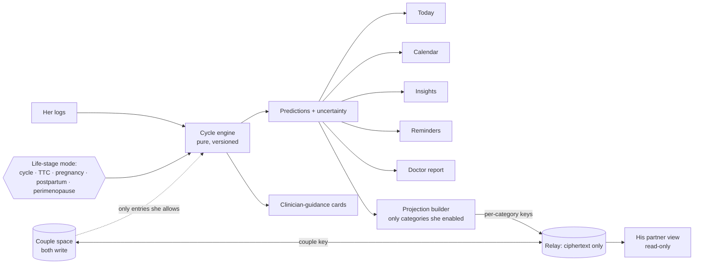

# Plan — private cycle tracker for two (Flo-equivalent, iPhone web app)

**Status:** Stage C draft, 2026-10-02.

- Made by the Stage C plan-synthesis worker (`github-copilot/claude-opus-5.5`, high thinking), from the preserved planning prompt (`~/firstmate/data/flo-planning/planning-prompt.md`, which supersedes the older committed `PLANNING_PROMPT.md`), the Stage C note, the six research reports and the cross-check.
- **Not yet critiqued:** Stage D (independent plan critique) and Stage E (fixes) are later tasks.
- **Not yet approved:** Stage F.
- **No application code exists.** None is written before approval.

Supporting files:

| Area | Files |
|---|---|
| Research | [R1](research/R1-flo-feature-inventory.md) · [R2](research/R2-flo-methods.md) · [R3](research/R3-clinical-methods.md) · [R4](research/R4-ios-pwa-capabilities.md) · [R5](research/R5-storage-sync-hosting.md) · [R6](research/R6-beyond-flo.md) · [Cross-check](research/crosscheck-stage-b.md) |
| Design | [Feature matrix](feature-parity-matrix.md) · [Algorithms](algorithms-spec.md) · [Architecture](architecture.md) · [Storage/sync decision](storage-sync-decision.md) · [Security & privacy](security-privacy.md) · [UX & content](ux-spec.md) |
| Delivery | [Tests & gates](test-strategy.md) · [Agent operating model](agent-operating-model.md) · [Roadmap](roadmap.md) · [Task briefs](task-briefs.md) · [Backlog import](backlog-import.md) · [Consistency check](consistency-check.md) · [ADRs](../adr/README.md) |

## 1. Executive summary

We will build a private app for two people. It is installed from Safari onto both iPhones' Home Screens, works offline, and costs nothing to run.

**What she can do:**
- Track her periods, symptoms, mood, desire and sex, in three taps or fewer from the Today screen.
- See predictions that always show a range ("around Oct 8, between Oct 4 and 10"), with a plain "Why?" explanation.
- Learn from her own logs over time: when she has tended to feel more or less energy or desire, and when she has tended to feel like sex. These are always her own past patterns, never a stereotype and never a promise.
- Get reminders to log while she is on her period, and short "did you know" cards in original wording with cited sources.

**What he can do:**
- See only what she chooses to share, one category at a time. Sharing starts **off**. She can pause or revoke it at any time without giving a reason.
- Add couple entries, such as dates, notes and affectionate notes, which both can see.

**How the protection works:**
- Her choices are enforced by **encryption**. His phone is never given the keys to anything she has not shared.
- Revoking stops future sharing. It cannot make him "unsee" what he already saw, and the app says so plainly.

**Where the data lives:**
- On each phone, encrypted.
- A free "mailbox" service only ever handles scrambled data, and passes it between the phones.
- She keeps encrypted backup files.
- If the free service stops working, the phones can swap encrypted files directly.

**What the app never does:**
- It never labels a day "safe". Pregnancy is always described as possible.
- It does not diagnose. When the logs match a warning pattern from a published guideline, it suggests talking to a clinician.

**What we can and cannot promise about Flo:**
- Flo does not publish its formulas. We copy its *documented* rules and use evidence-based methods for the rest. Each one is labelled.
- We cannot measure Flo's accuracy. Instead the app shows her its own track record.

**Order of work:**
1. P0 foundation and phone checks.
2. P1 her tracker.
3. P2 couple features.
4. P3 intelligence.
5. P4 contraception and life stages.
6. P5 Premium-style extras.
7. P6 hardening.
8. P7 stretch goals.

Each phase ends with a demo on both phones and the captain's "continue".

## 2. Glossary

| Term | Plain meaning |
|---|---|
| Cycle | From the first day of one period to the day before the next. Day 1 is the first day of real bleeding (not spotting) |
| Period / spotting | A period is real flow. Spotting is light bleeding that doesn't start a period |
| Ovulation | The release of an egg, usually about 12–16 days before the next period. It can't be seen directly at home |
| Fertile window | The few days when sex can lead to pregnancy: roughly the 5 days before ovulation plus the day of ovulation. It moves from cycle to cycle |
| LH test | A urine "ovulation test". A positive result usually means ovulation within about 2 days |
| BBT | Basal body temperature. It rises slightly *after* ovulation, so it confirms ovulation afterwards rather than predicting it |
| Cervical mucus | Vaginal discharge that becomes clear and stretchy near ovulation |
| PMS / PMDD | Symptoms before a period; PMDD is a severe form. Only a clinician diagnoses these |
| PCOS / endometriosis / fibroids | Conditions that can cause irregular, painful or heavy periods. The app can only suggest "worth discussing" |
| LMP / EDD / gestational age | Last menstrual period / estimated due date / weeks of pregnancy counted from the LMP |
| Perimenopause | The years before menopause, usually from the mid-40s. It is not relevant to 21-year-olds except as information |
| Hormonal contraception | Pill, patch, ring, implant, injection or hormonal IUD. These change bleeding, and the app stops showing fertile-day estimates |
| Withdrawal bleed | Bleeding during the pill-free days. It is not a natural period |
| PWA | A website installed to the Home Screen that behaves like an app |
| E2EE | End-to-end encryption: only our phones hold the keys |
| Category key / epoch | The key for one shared category. A new "epoch" key is made when she revokes, so old keys stop working for new data |
| Projection | The small summary her phone makes for a shared category, for example "cycle day 12, period expected Oct 4–10". It is never her raw logs |
| Relay / mailbox | The free cloud program that stores and forwards encrypted data. It cannot read it |
| HLC | Hybrid logical clock. It orders edits from two phones so that sync is predictable |
| Tendency | A pattern in her own past logs, with how many cycles and days support it. It is not a prediction, and never consent |
| MoSCoW | Must / Should / Could / Won't priority |
| ADR | Architecture decision record |

## 3. Users, roles and consent model

**Her (owner).**
- Owns and logs all of her health data on her phone. Her phone is the only one that can read it.
- Chooses sharing **category by category**, with everything **off by default**, and can preview exactly what he sees.
- Can pause (one tap, no reason asked), revoke (keys rotate) or unpair.

**Him (partner).**
- Sees a read-only view built from her shared categories only.
- Writes couple entries, love notes and replies.
- Cannot edit her data or ask for more sharing inside the app.

**Both.**
- Share an encrypted **couple space**. Each person edits only their own entries.
- She decides which couple entries may feed her insights.
- Either person can unpair.

**Desire is not consent.** Logs of desire describe her past and never imply willingness or permission. The cycle owner's earlier answers name the categories she would like to share (cycle, and when she has tended to feel like sex). These answers are **not** consent: actual sharing stays off until she turns categories on in the app.

The full rules are in [security-privacy.md §2](security-privacy.md#2-consent-and-privacy-rules-testable) (CR-01 to CR-21), and each rule has a test.

## 4. Assumptions and decisions

| # | Assumption or decision | Source / label |
|---|---|---|
| 1 | Two adults (21) on iPhones with Safari. iOS versions are unknown and are recorded in P0 | Prompt §2; R4 |
| 2 | The workspace is the registered local-only repo `~/code/flo` (supersedes the prompt's old `flo_remade` path) | Intake record |
| 3 | No Flo integration, import or backup is wanted. This app is meant to be her main day-to-day tool | Stage C note |
| 4 | The app's own encrypted backup/restore is **kept by default** until the captain answers AP-01 | Stage C note; constitution rule 8 |
| 5 | "Best time for sex" means her own past desire and comfort patterns. It is not a fertility claim, contraception or consent | Stage C note |
| 6 | Affectionate notes are a narrow couple-space feature, not a messaging framework | Stage C note |
| 7 | Free/Premium tiers mostly can't be independently verified; parity targets the *function* | Cross-check §1 |
| 8 | Flo's formulas are undisclosed; we use documented Flo rules plus labelled evidence-based substitutes | R2; algorithms-spec.md |
| 9 | Cloudflare Free (Workers + D1 + Pages) is the relay and host, **pending Phase 0 checks FB-01/02/09** | storage-sync-decision.md |
| 10 | Everything else in the plan was decided by the planner and is logged in ADRs 0001–0009 | docs/adr |

The constitution (prompt §4) applies to every task. [test-strategy.md §3](test-strategy.md#3-constitution-enforcement-matrix-every-section-3-and-4-rule) maps each rule to how it is enforced and how it is checked.

## 5. Feature parity matrix (summary)

[Full matrix](feature-parity-matrix.md): **74 Flo functional groups** (F-001–F-074) and **20 Beyond-Flo entries** (F-101–F-120).

| Decision | Count | Examples |
|---|---|---|
| Replicate | 25 | Period/symptom/sex logging, calendar, BBT/LH, history graphs, medication reminders |
| Adapt | 34 | Predictions (transparent engine), pregnancy chance (qualitative), partner features (category-by-category with E2EE), pregnancy dating (ACOG), perimenopause tools (age-gated, unvalidated score), symptom checker (local rules) |
| Replace | 8 | Accounts → device keys; Health Assistant → local rules; content/courses → original cited text; pregnancy visuals |
| Not applicable | 5 | Teen mode, Secret Chats, Anonymous Mode, subscriptions, offer notifications |
| Not feasible on iOS web | 2 (+1 partly) | Apple Health sync and Apple Watch (closest: an export-file import; Watch mirrors notifications). Closed-app reminders are partly infeasible: generic push instead |

Unverified tiers and Flo's own contradictions are carried in the matrix's final table without being resolved. These cover partner calendar scope, quiz disclosure, the doctor report's six cycles vs six months, the 41-week vs 280-day due date, and tracker counts.

## 6. Beyond-Flo features (scored)

| ID | Feature | V/E/P | Decision |
|---|---|---|---|
| F-101 | Sharing start date, "see what he sees", per-entry opt-in | 5/3/3 | Add (P2) |
| F-102 | "How can I support you?" cards | 5/2/2 | Add (P2) |
| F-115 | Couple space (dates, sex, notes) | 3/3/3 | Add (P2) |
| F-117 | Affectionate notes (narrow) | 4/2/2 | Add (P2) |
| F-113 | Quick-hide plus lock | 4/2/1 | Add (P2) |
| F-114 | Discreet generic notifications | 4/3/2 | Add (P2) |
| F-119 | Encrypted backup and recovery code | 5/3/2 | Add (P2), pending AP-01 |
| F-105 / F-106 / F-118 | Private desire/comfort/mood tendencies; "when you've tended to feel like sex" | 5/4/3 · 4/4/3 · 5/3/3 | Add (P3) |
| F-109 / F-110 / F-111 | Late-period check-in; pill tracking; EC/test/STI organizer | 5/3/3 · 5/3/2 · 4/3/3 | Add (P4) |
| F-103 | Relationship check-in | 5/3/3 | Add (P5) |
| F-104, F-107, F-108, F-112, F-116, F-120 | Intimacy-preference prompts; lifestyle correlations; Shortcuts; PBAC; log Q&A; .ics | — | Backlog |

V = value, E = effort, P = privacy risk, each 1–5. Scores come from R6 (ordinal, inferred); F-117, F-118 and F-119 are scored by this plan.

## 7. How everything ties together

The detailed version, with private, shared and couple areas and the mode state machine, is in [architecture.md §1](architecture.md#1-how-everything-ties-together). What changes in each mode is listed in the same section.

## 8. Algorithms (summary)

Full specification: [algorithms-spec.md](algorithms-spec.md). Every algorithm has pseudocode, defaults for new users, edge cases and hand-computed test vectors.

| ID | Computation | Basis |
|---|---|---|
| A0 | Local calendar dates (no UTC/DST errors) | Design |
| A1 / A3 | Period vs spotting episodes; period length | Evidence + design; Flo auto-end (shown as "assumed") |
| A2 | Next period: Flo's documented history rules (last 12 cycles, exclude >90 days and >1 year old) + recency-weighted median + MAD window. One unusual cycle widens the window; three repeats move the predicted day | Flo-documented + evidence/design |
| A4 / A5 | Calendar ovulation (luteal 12–16), Flo 7-day core window + wider band; chance Lower/Medium/Higher, **never zero, no %** | Flo-documented + Wilcox/ASRM; Adapt |
| A6–A9 | BBT shift (independently written; no AGPL code), LH next-day rule, mucus peak, marker priority | Flo-documented + WHO/JHU, ASRM |
| A10 | Pregnancy dating: LMP+280, IVF transfer+(266−embryo age), clinician overrides | ACOG CO700 (Adapt from Flo's 41-week text) |
| A11 | Warning cards W-01–W-11, each tied to its source (ACOG, NHS, NICE, FIGO, PCOS 2023, ESHRE) | Evidence; trigger counts are design choices, flagged for audit |
| A12 | Personal tendencies: minimum 3 cycles; ≥6 logged days from ≥3 cycles per phase; missing ≠ none; coverage shown; "no clear pattern" and "recently changed" states; separate from fertility and consent | Design (motivated by Roney 2013, Romans 2012, Doornweerd 2025) |
| A13–A16 | Analytics with source-labelled ranges; perimenopause signals (age-gated; unvalidated impact summary); checker patterns; contraception/postpartum/loss modifiers | Evidence + design |
| A17 / A18 | Card selection; backtesting vs 28-day and plain-average baselines (MAE, ±1/±2, coverage) on synthetic data; on-device track record | Design |

## 9. Architecture, and the storage and sync decision

**Stack:** strict TypeScript, Preact, Vite, IndexedDB and WebCrypto. Runtime dependencies are limited to five small packages.

**Module contracts come first** (`src/contracts`). Main modules: engine, crypto, data, lock, share, pairing, sync, couple, backup, reminders and content.

**Two-person model:**
- Device keys, with no accounts.
- In-person two-way QR pairing plus a 6-digit safety code.
- Three data areas: private (key PDK), shared projections (per-category keys) and couple (key CPK).
- Single-writer records, HLC last-writer-wins and conflict copies, so no edit is silently lost.

**Storage, sync and backup decision.** The weighted matrix covers all six options. Recommended: **local-first + Cloudflare Workers/D1 ciphertext mailbox + encrypted backup files**, scoring 415/500. Manual exchange scores 410, so it is kept as a first-class fallback. Hosting is Cloudflare Pages with strict headers. Reminders are a generic daily Web Push, with details shown after unlock.

**Key documents:**
- [architecture.md](architecture.md);
- [storage-sync-decision.md](storage-sync-decision.md), which includes the hard-$0 and no-account limits, fallbacks, data-loss risks and recovery;
- [ADR-0003](../adr/0003-storage-sync-backup-hosting-notifications.md).

**Phase 0 feasibility blockers** (to prove before relying on them):

| ID | What must be proven |
|---|---|
| FB-01 | Cloudflare works with no payment method |
| FB-02 | Worker CPU stays within limits |
| FB-03 | Storage persists on the phones |
| FB-04 | File export works |
| FB-05 | Camera QR scanning works in the Home Screen app |
| FB-06 | Push notifications arrive |
| FB-07 | Passkey PRF works |
| FB-08 | Verifier sandbox can be enforced |
| FB-09 | Provider terms allow this use |
| FB-10 | Passphrase stretching is fast enough |

## 10. Privacy and security

Full design: [security-privacy.md](security-privacy.md).

- **Threat model** covers T1–T12. Remaining risks are stated honestly, for example that a malicious app build could leak data from an unlocked app, and that metadata reaches providers.
- **Keys:**
  - passphrase (PBKDF2-SHA-256, 600k iterations), recovery code or optional passkey PRF → local master key;
  - per-category keys wrapped to his device with ECDH P-256;
  - rotation on revoke or unpair.
- **Strict CSP and headers;** no third-party origins.
- **Network allowlist test;** crypto-erasure for "delete all".
- **Dependency policy:** exact pins, licence allowlist with no GPL/AGPL in the bundle, and audit at every gate.
- **No PIN** is offered in v1 (AP-07).

## 11. UX

Full specification: [ux-spec.md](ux-spec.md).

- **Navigation.** Her tabs: Today · Calendar · ＋Log · Insights · Us. His tabs: Today · Calendar · Us.
- **Three-tap logging.**
- **Uncertainty** is one line plus a "Why?" sheet.
- A **permanent "No day is 'safe' without contraception" line** appears on every fertility surface.
- **Sharing controls** are reachable from Today, with a preview-before-confirm step.
- **Partner tips** come only from her shared data and her support requests.
- **Quick-hide**, WCAG 2.2 AA, and light and dark mode.
- **Educational content:** an original card format with claim-to-source mapping and a required Opus fact-check. The P1 core set has 15 cards, covering cycle basics, "not birth control", test timing, EC, STI prevention, consent and when to get help.

## 12. Verification strategy

Full strategy: [test-strategy.md](test-strategy.md).

- **Test pyramid:** unit, property, golden vectors, backtest, component, WebKit e2e on iPhone profiles, offline/update, migrations, crypto, backup, consent, two-device sync, pairing, time-zone matrix, a11y, performance, network allowlist and screenshots.
- **Enforcement matrix:** every rule in prompt Sections 3 and 4 has an enforcement mechanism and a check.
- **Definition of Ready / Done,** phase gates, and a 14-step real-iPhone smoke checklist.
- **Nothing has been run yet.**

## 13. Agent operating model, model/credit policy and board

Full model: [agent-operating-model.md](agent-operating-model.md) and [ADR-0009](../adr/0009-agent-operating-model-on-firstmate.md).

**Roles.** No second orchestrator. The first mate orchestrates (read-only on the project), ship crewmates implement, and independent scout verifiers check the exact revision.

**Routing**, from `~/firstmate/config/crew-dispatch.json`, in priority order, with high thinking as the minimum:

| Priority | Work | Model |
|---|---|---|
| 1 | High-risk verification | `github-copilot/claude-opus-5.5` |
| 2 | Design, extensive work, escalation | `github-copilot/claude-opus-5.5` |
| 3 | Research | `github-copilot/gpt-6.1-sol` |
| 4 | Bounded high-risk implementation (with a required Opus verify) | `github-copilot/gpt-6-luna` |
| 5 | Routine work | `github-copilot/gpt-6-luna` |

**Fix rounds.** After 2 documented failed rounds, the next attempt goes to Opus. After 3 rounds, stop and block; changing the model never resets the count.

**Limits.** At most 3 workers. Foundation tasks run one at a time. Integration follows each wave.

**Verifier sandbox.** The proposed setup is Pi `--tools` plus a bubblewrap sandbox extension. It is **not yet proven**, and is recorded as FB-08 if it cannot be enforced.

**Board.** The Firstmate backlog is the board. A GitHub Projects board is optional and shows phases and gates only; it is unused while the repo is local-only.

## 14. Roadmap, phases and gates

Full roadmap: [roadmap.md](roadmap.md).

| Phase | Goal | Gate |
|---|---|---|
| P0 | Foundation, approvals, feasibility on phones | gate-phase-0 |
| P1 | Her core tracker | gate-phase-1 |
| P2 | Pairing, sharing, couple space, backup, push | gate-phase-2 |
| P3 | Markers, tendencies, analytics, doctor report, personalized cards | gate-phase-3 |
| P4 | Contraception, late-period check-in, TTC, pregnancy, postpartum, perimenopause | gate-phase-4 |
| P5 | Checker, local assistant, lessons, quizzes, check-ins | gate-phase-5 |
| P6 | Security review, performance and a11y, production deploy, user guide | gate-phase-6 |
| P7 | Health-export import, optional on-device model | — |

Every gate needs a verification report, a demo on both phones and the captain's "continue".

## 15. Task list (summary)

[backlog-import.md](backlog-import.md) has **91 items** for P0–P2: 47 ship tasks, 39 scout (verify or feasibility) tasks and 5 gates. Detailed briefs are in [task-briefs.md](task-briefs.md).

| Phase | Implementation | Verify | Gates | First waves |
|---|---|---|---|---|
| P0 | Agents/skills, toolchain, sandbox proof, relay spike, probe, contracts, design tokens, localdate, crypto, shell, SW, DB store, CSP/network, synthetic data, lock, integration | One for each high-risk task + wave review + phase verify | p0-approvals, p0-device-feasibility, gate-phase-0 | W1: approvals gate, dispatch-validate, agents-skills · W2: sandbox-proof, toolchain, relay-spike |
| P1 | Log repo, episodes, onboarding, quick log, cycle engine, log forms, calendar, today, warnings, backtest, export/import, delete-all, reminders, settings, core content, integration | Per high-risk task + wave review + phase verify | gate-phase-1 | W1: log-repo (foundation) |
| P2 | Identity, share keys, sync core, relay, projection, transport, pairing, share controls, partner view, couple space, backup, unpair/delete, push, quick-hide, passkey, integration | Per task + UX review + phase verify | gate-phase-2 | W1: identity (foundation) |

The dependency graph is acyclic, and no wave has two tasks owning the same file; both are checked in [consistency-check.md](consistency-check.md). **Nothing is imported until Stage F approval.**

## 16. Risks and mitigations

| Risk | Mitigation |
|---|---|
| iOS evicts or deletes data (R4) | `persist()`, backups with restore tests, optional relay backup, his phone's copy of shared data |
| Cloudflare requires payment or changes its terms (FB-01/09) | Manual exchange mode; GitHub transport fallback (AP-12); local copies are authoritative |
| Push is unreliable on iOS (FB-06) | In-app reminders always work |
| Passkey PRF bugs (R4 T1–T3) | Optional only; passphrase plus recovery code |
| Forgotten passphrase and recovery code | Stated plainly at setup; recovery code confirmation; passkey option |
| A partner pressures her to share | Off by default, no-reason pause, no share requests or receipts, preview, consent history |
| Medical harm from wrong guidance | Source-tied rules, never "safe days", Opus medical audit and fact-check before merge, informational framing |
| Algorithms underperform for her | Wide honest windows, an on-device track record, versioned upgrades in shadow mode |
| Supply-chain compromise | 5 runtime dependencies, pins, audits, CSP, network test |
| Verifier sandbox can't be enforced (FB-08) | Recorded as a blocker; interim policy decided by the captain (AP-16); no false read-only claims |
| Licensing gaps: MRS, PBAC, datasets, drip/sympto | Not used without approval; original substitutes; no GPL/AGPL code |
| Scope size (74 + 20 features) | Phased with gates; P3–P7 detailed later; Must items first |
| Model credit cost | Luna for bounded work, Opus only where required; measure usage at each gate |

## 17. Questions for my girlfriend

These are non-blocking. Sharing stays off until she chooses in the app.

1. Which categories, if any, would you like to turn on first? You mentioned your cycle and when you've tended to feel like sex. Would you also want the fertility estimate shared, given that it is never a "safe day" signal?
2. What daily time suits a generic check-in reminder, and do you want "Still bleeding?" prompts every evening during your period?
3. Should his affectionate notes appear on your Today screen, or in a collection you open when you like, or be off?
4. Would you use Face ID unlock if your phone supports it, or is the passphrase fine? Where will you keep your recovery code?
5. Would you realistically do a weekly backup to Files/iCloud, or prefer the optional automatic encrypted copy on the mailbox?
6. Which country's clinical services and crisis lines should the app point to?
7. Is there anything about the quick-hide or pause buttons you'd like to work differently?

## 18. Open questions and items needing approval

The captain's answers are recorded in `flo-plan-approval` at Stage F.

**A. Product choices and clarifications**

| ID | Item | Proposed default |
|---|---|---|
| AP-01 | **Keep this app's own encrypted backup/restore** (constitution rule 8)? "No need to establish backup" may have meant only *no Flo backup* | **Keep** (F-119) until answered |
| AP-04 | Pregnancy chance shown as qualitative **Lower / Medium / Higher, never zero, no percentages**: an adaptation of the "never shows zero" requirement, cited to R3 §3 | Approve |
| AP-05 | Pregnancy dating follows **ACOG LMP+280**, not Flo's "LMP + 41 weeks" help text | Approve |
| AP-06 | Fertile window shows Flo's 7-day core **plus** a wider "possible" band (honest uncertainty) | Approve |
| AP-07 | **No 6-digit PIN** in v1 (offline-guessable); passphrase plus optional Face ID | Approve (or accept a weaker PIN knowingly) |
| AP-08 | On unpair, each phone keeps the couple entries its owner wrote and deletes the other's; either can export first | Approve |
| AP-09 | Life-stage changes are **never** told to the partner unless she shares `life_stage` (Flo discloses automatically) | Approve |
| AP-13 | Optional encrypted relay backup (her full encrypted backup stored on Cloudflare) | Offer as opt-in |
| AP-14 | Event push to him when she sends a support card (reveals timing) | Off unless she enables it |
| AP-15 | Affectionate notes limited to the couple space: Today note or collection, no scheduled push, no read receipts | Approve narrow scope |
| AP-19 | Original **text-only** lessons, no video/audio courses | Approve |
| AP-20 | App name and icon ("Tide" placeholder, original icon) | Captain to choose |
| AP-22 | Perimenopause "impact summary" is original and **unvalidated**; MRS only after licence review | Approve |
| AP-23 | Symptoms never move period predictions in v1 (Flo's undisclosed ML does) | Approve |
| AP-24 | Partner calendar shows data only from her chosen start date onward | Approve |
| AP-25 | Couple quizzes reveal only after both submit | Approve |
| AP-26 | Doctor report defaults to 6 cycles incl. current, with a 6-month option | Approve |
| AP-27 | Her country, for crisis resources and local care schedules | Answer needed before P1 content |

**B. Accounts, money, infrastructure and destructive actions (Section 3 checkpoints; collected in `p0-approvals`)**

| ID | Item |
|---|---|
| AP-10 | Create **one Cloudflare account** (Free, no payment method) for Pages + Workers + D1; create the relay enrollment secret and VAPID keys as Worker secrets; use a `pages.dev` domain (a custom domain costs money) |
| AP-11 | Accept the storage trade-off: relay + backups (415) over manual-only (410) |
| AP-12 | Fallback if Cloudflare fails: manual exchange only, or a GitHub data-repo transport (needs a GitHub account per person; tokens on phones) |
| AP-16 | Install the verifier-sandbox prerequisites (bubblewrap system package; Pi sandbox extension npm dependency). If FB-08 stands, choose an interim policy: proposed review-only verifiers without bash, with the first mate running tests |
| AP-17 | Repository mode: stay **local-only** (current registration) or move to a private GitHub repo with PRs |
| AP-18 | Public Cloudflare preview deployments with synthetic data only |
| AP-21 | Use public cycle datasets for backtesting (licences unclear) — proposed **no**; synthetic only |
| AP-28 | Install the pinned npm dependency set listed in architecture.md §2 during P0 |
| AP-29 | Production deploy at P6 (a later checkpoint; listed for completeness) |

**C. Every feature that is not a straight replication (AP-02)**

| Decision | Features |
|---|---|
| Adapt | F-003, F-004, F-007, F-008, F-017, F-018 (partly Not feasible), F-020, F-021, F-030, F-032, F-033, F-034, F-035, F-038, F-041, F-042, F-043, F-044, F-045, F-046, F-047, F-052, F-055, F-056, F-057, F-058, F-059, F-061, F-062, F-063, F-064, F-071, F-072, F-074 |
| Replace | F-025, F-040, F-049, F-050, F-051, F-053, F-054, F-073 |
| Not applicable | F-026, F-065, F-066, F-069, F-070 |
| Not feasible on iOS web | F-067, F-068 |

Each feature's justification is in the [matrix](feature-parity-matrix.md).

**D. Every Beyond-Flo addition (AP-03)**

| Phase | Additions |
|---|---|
| P2 | F-101, F-102, F-113, F-114, F-115, F-117, F-119 |
| P3 | F-105, F-106, F-118 |
| P4 | F-109, F-110, F-111 |
| P5 | F-103 |

**E. Known gaps carried, not resolved**

| Gap | Status |
|---|---|
| Flo tier contradictions and unverified entitlements | Carried |
| Original STRAW+10 full text | Not inspected |
| Questionnaire and PBAC permissions | Unknown |
| Dataset licences | Unclear |
| Current PRF production fixes | Unverified |
| Real-device behaviour of storage, push, camera and file share | Untested |
| Provider no-charge enforcement | Untested |
| Measured Flo accuracy | Unavailable |
| Clinical safety | Not proven; requires the Opus audits in each phase |
