# Roadmap, phases and gates (Step 10)

**Status:** Stage C draft, 2026-10-02.

- Detailed tasks exist for **P0–P2** only: see [task-briefs.md](task-briefs.md) and [backlog-import.md](backlog-import.md).
- P3–P7 list their feature IDs, exit criteria and demo contents. Their tasks are written at the gate before each of those phases, using what was learned by then.
- Every phase ends with a phase verification report (`pN-phase-verify`), a demo package, the real-iPhone smoke checklist and a captain-held `gate-phase-N`.
- Nothing starts before Stage F approval (`flo-plan-approval`).

```mermaid
flowchart LR
  A[flo-plan-approval<br/>Stage F] --> P0[P0 Foundation] --> G0{gate-phase-0}
  G0 --> P1[P1 Core tracking] --> G1{gate-phase-1}
  G1 --> P2[P2 Couple features] --> G2{gate-phase-2}
  G2 --> P3[P3 Cycle intelligence] --> G3{gate-phase-3}
  G3 --> P4[P4 Contraception & life stages] --> G4{gate-phase-4}
  G4 --> P5[P5 Premium equivalents & Beyond-Flo] --> G5{gate-phase-5}
  G5 --> P6[P6 Hardening & launch] --> G6{gate-phase-6}
  G6 --> P7[P7 Stretch]
```

## P0 — Foundation

- **Goal.** Set up a safe, tested base before any health feature exists:
  - the operating model, proven;
  - local automated checks;
  - the app shell, with offline and update safety;
  - the encrypted data layer and the lock;
  - the design system;
  - feasibility answers on real phones;
  - all account and credential approvals collected in one place.
- **Features.** F-024 (passphrase lock). Constitution infrastructure: rules 2, 3, 6, 9 and 10.
- **Feasibility blockers resolved or recorded:** FB-01 to FB-10 ([storage-sync-decision.md §10](storage-sync-decision.md#10-named-phase-0-feasibility-blockers)).
- **Exit criteria:**
  - `npm run check` and `npm run e2e` pass on `main`;
  - crypto, data, lock, SW and CSP verify reports PASS;
  - the verifier-sandbox proof is recorded, or FB-08 is recorded as a blocker with the captain's interim decision;
  - the device feasibility results from both phones are recorded;
  - `p0-approvals` is resolved;
  - no health features yet.
- **Demo.** Install on both iPhones. Set a passphrase and recovery code. Lock and unlock. Show that it works offline. Run the probe page results. Show the update flow with a dummy change.

## P1 — Core tracking (her)

- **Goal.** Her day-to-day tracker on one phone, with no partner yet.
- **Features.** F-001–F-015, F-017, F-019–F-023, F-033 (v1), F-071, F-072. Also the P1 core education cards (F-035 subset) and desire/comfort logging (F-105 input).
- **Exit criteria:**
  - three-tap logging passes;
  - the engine v1 golden vectors and properties pass;
  - the backtest beats or ties the baselines on synthetic data;
  - warnings v1 pass the medical-safety verify;
  - export, import and delete-all are verified;
  - the core cards are fact-checked;
  - a11y, network and TZ suites pass;
  - smoke test on both phones (his phone for install and lock only).
- **Demo.** Onboarding without an account. Log a synthetic period and symptoms in ≤3 taps. Calendar and Today with prediction windows and the "no safe days" line. A heavy-bleeding warning card on synthetic data. Export JSON/CSV and import it back. Delete all data.

## P2 — Couple features

- **Goal.** Consent-centred sharing between the two phones, encrypted end to end, plus the couple space, backup and generic notifications.
- **Features.** F-018, F-022 (relay part), F-024 (passkey, if FB-07 passed), F-025, F-055–F-060, F-101, F-102, F-113, F-114, F-115, F-117, F-119.
- **Exit criteria:**
  - every T-CON test passes;
  - two-device sync, conflict, pairing, revocation and unpair tests pass;
  - privacy/security verify reports PASS for pairing, share keys, sync, relay, projection, backup, push and passkey;
  - the relay runs on the approved free plan with no payment method (FB-01);
  - the encrypted backup → restore round trip works on both real phones;
  - generic push works on the real phones (FB-06), or in-app-only mode is accepted.
- **Demo.**
  1. Pair in person and compare the safety codes.
  2. She shares one category, uses "see what he sees", then pauses and revokes. He sees the effects.
  3. Couple entries, a love note and a support card.
  4. Generic notification on the lock screen.
  5. Back up, wipe and restore.
  6. Unpair from his side.

## P3 — Cycle intelligence (later detail)

- **Features.** F-027–F-032, F-033 (full), F-034, F-035, F-073, F-105, F-106, F-118, and the prediction track record (A18).
- **Exit criteria:**
  - A6–A9, A12 and A13 vectors pass, with an Opus algorithm audit;
  - the tendencies engine shows the INSUFFICIENT, NO_CLEAR_PATTERN and RECENTLY_CHANGED states on synthetic data;
  - the doctor report prints to PDF on a real iPhone;
  - personalized cards are fact-checked;
  - the backlog decision on PBAC (F-112) is recorded.
- **Demo.** BBT and LH synthetic cycles moving the fertile window. Her tendencies with coverage. The "When you've tended to feel like sex" card. The doctor report PDF.

## P4 — Contraception and life-stage modes (later detail)

- **Features.** F-016, F-036–F-046, F-048, F-064, F-074, F-109, F-110, F-111.
- **Exit criteria:**
  - A10, A14 and A16 vectors pass, with medical-safety and algorithm audits;
  - pregnancy dating matches ACOG vectors;
  - the pregnancy-loss flow passes a sensitivity review;
  - perimenopause is age-gated;
  - mode changes are invisible to the partner unless shared (T-CON-09 re-run);
  - the questionnaire licensing decision (MRS) is recorded.
- **Demo.** Pill-pack predictions. The late-period check-in. A synthetic pregnancy with weekly content and dating. Perimenopause mode on a synthetic 47-year-old profile.

## P5 — Premium equivalents and Beyond-Flo additions (later detail)

- **Features.** F-047, F-049–F-054, F-061–F-063, F-103. Backlog review of F-104, F-107 and F-116.
- **Exit criteria:**
  - the symptom checker (A15) has explainable outputs with sources and passes a medical-safety audit;
  - the local assistant answers a fixed question set with reasoning and citations, with no network use;
  - the lesson library is fact-checked;
  - couple quizzes reveal only after both submit.
- **Demo.** The checker on synthetic PCOS-pattern data. The assistant explaining a late period. Lessons with sources. A check-in and quiz reveal.

## P6 — Hardening and launch (later detail)

- **Scope.**
  - an independent end-to-end security review (Opus) and a dependency audit;
  - a performance pass against the real-phone budgets and an accessibility pass;
  - production deploy (a captain approval);
  - a user guide for both of them;
  - backlog reviews of F-108 and F-120.
- **Exit criteria:** no high findings open; budgets met on both phones; the production URL is live with headers verified; the restore drill is done on real data by her, on her phone, never in the repo.
- **Demo.** The production install on both phones, plus a guided walkthrough.

## P7 — Stretch (later detail)

- **Features.**
  - F-067: Apple Health `export.xml` import.
  - An optional on-device model for the assistant. WebGPU shipped in Safari 26 (R4 S17), but no model has been benchmarked, so it must be benchmarked first and stay local-only.
  - Data imports from other apps.
- **Exit criteria:** an import fuzz test; model memory, latency and thermal benchmarks on both phones; zero network calls.
- **Demo.** Import a synthetic Health export. Ask the local model a question offline.

## Phase gate procedure (all phases)

`pN-phase-verify` (Opus spec/acceptance verifier) runs the gate commands on the integrated `main` revision and writes the phase verification report. The first mate then:
1. assembles the demo package;
2. sets `gate-phase-N` as a captain hold;
3. waits for "continue";
4. records the approval;
5. writes the next phase's tasks (from P3 onward).
