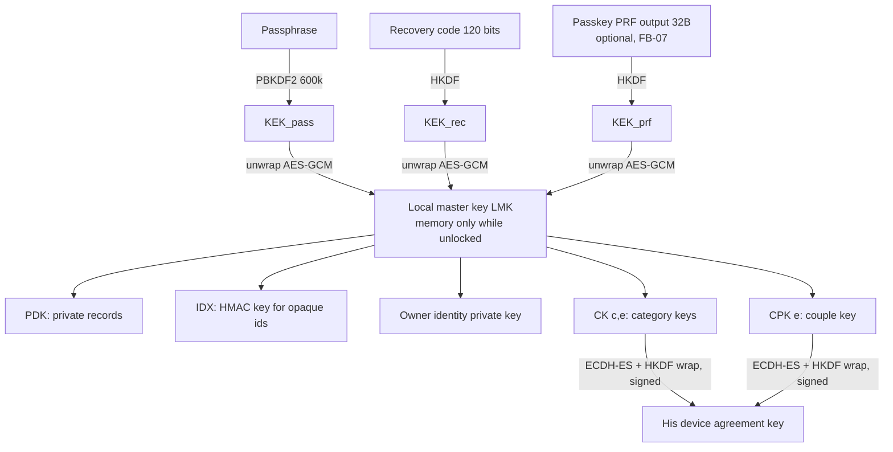

# Privacy and security design (Step 6)

**Status:** Stage E revision, 2026-10-02 (Stage C draft corrected after the Stage D critique; see [stage-e-resolution.md](stage-e-resolution.md)). This is **not** a security audit, and nothing here has been tested yet. The pairing protocol and key design are planner designs based on standard patterns, not formally analysed protocols. Every high-risk item needs an independent Opus privacy/consent/security review before merge ([agent-operating-model.md](agent-operating-model.md)). Platform facts come from [R4](research/R4-ios-pwa-capabilities.md) and provider facts from [R5](research/R5-storage-sync-hosting.md). Test IDs refer to [test-strategy.md](test-strategy.md).

## 1. Threat model

| # | Threat | Main mitigations | What is left over (stated honestly) |
|---|---|---|---|
| T1 | His phone receives more than she chose | Per-category keys; the projection builder only lets listed fields through; nothing raw from her private records is ever shared (CR-01/02/08); his backups and exports exclude her projections and keys (T-BAK-04) | The encryption separation holds only while the app code she runs is genuine. Whoever can change the served code (T6, T13) can defeat it in her unlocked app. Independent verification is a process control that lowers the chance of a defect; it is not a security property. Anything he has already seen cannot be unseen |
| T2 | Pressure to share | Off by default; pause takes one tap and asks for no reason; no "please share" requests; no streaks; "see what he sees" preview (CR-04, CR-17) | Social pressure outside the app cannot be engineered away |
| T3 | Her phone lost, stolen or left unlocked | Encryption at rest; auto-lock (default: 60 s in background, and on every cold start); quick-hide; strong passphrase; recovery code | While the phone is unlocked and the app is open, someone holding it can see the data |
| T4 | His phone lost or stolen | His local copies are encrypted under his passphrase; she can revoke or unpair from her phone | Data he could already see is exposed if his passphrase is also compromised |
| T5 | Shoulder-surfing | Quick-hide; generic notifications; a neutral app name and icon option (F-113) | The app's presence on the Home Screen is visible |
| T6 | Compromised host or dependency (supply chain) | Few dependencies; exact version pins; lockfile; licence and audit checks; strict CSP; built assets reviewed; no third-party origins; deploys only from landed, verified commits; deployed bytes compared with the build (T-SEC-08) | A malicious build served to an unlocked app could leak data. End-to-end encryption does not protect against malicious app code (R5 §2). The checks are detective and procedural; none of them eliminates this risk |
| T7 | Cross-site scripting (XSS) | No `innerHTML`; content compiled at build time; CSP `script-src 'self'`; Trusted Types where supported (**untested**) | Browser bugs |
| T8 | Breach at a cloud provider | Only ciphertext and opaque ids reach the provider; bodies are not logged | Metadata: IPs, sizes, timing, push schedule (storage-sync §9) |
| T9 | Legal request to a third party | The provider holds ciphertext plus metadata only; no keys | Metadata can be disclosed |
| T10 | Malicious or curious relay operator | Signed requests; envelopes are authenticated with AES-GCM using associated data (AAD); metadata minimisation (PR-07) | The operator can delete or withhold data, so phones and backups stay authoritative; the operator can see traffic patterns. When the operator is her partner, see T13 |
| T11 | Replayed or forged control messages ("revoke", "unpair") | Owner signatures, nonces, timestamps, version numbers that only increase | — |
| T12 | Covert tracking by either partner | No location, usage or "last seen" telemetry; she can review her consent history; lint bans geolocation APIs (CR-10); operator capabilities are disclosed (PR-08) | The operator channel in T13 cannot be closed by app code |
| T13 | **Her partner as infrastructure and code operator.** Under the drafted default, the captain (her partner) would own the Cloudflare account that serves the app code and runs the relay, and his agents run the deploys (AP-10, AP-18) | Account-custody options in AP-10 (her-owned, joint, or captain-owned with disclosure); plain disclosure in onboarding and Sharing help (PR-08, T-UX-05); metadata minimisation (PR-07, T-RELAY-02); scoped deploy credential stored outside the repo; deploys only from landed, verified commits with a recorded revision and build hash (T-SEC-08) | **Honest residual risk.** Whoever controls the account can: re-enable logs or tail live requests at any time and see request timing, sizes, IP-derived location and her push time and time zone; infer when she syncs, pauses or revokes (slot deletions); read and delete ciphertext rows; and deploy modified app code that reads her data the next time she unlocks. Disabling logs does not make the infrastructure invisible to its owner, and no check here eliminates the malicious-build risk. Only the custody choice changes who holds these powers; Cloudflare always sees the metadata (T8) |
| T14 | Pairing substitution (someone who sees or swaps the QR codes or pairing files tries to insert their own keys) | Commit-then-reveal 6-digit safety code over the full transcript ([architecture.md §4.2](architecture.md#42-pairing-in-person)); 10-minute single-use sessions; a mismatch aborts and is logged in her consent history | About a one-in-a-million chance per attempt that an attacker's code matches; protection depends on both people actually comparing the codes. Planner design, to be audited (T-PAIR-02) |

## 2. Consent and privacy rules (testable)

Every rule from constitution §4 rule 1 is enforced by **encryption or data separation** and has a test. "UI" in the enforcement column means the user interface is *additional* to the enforcement, never the only protection.

| ID | Rule | Enforcement | Test |
|---|---|---|---|
| CR-01 | Nothing is shared by default, including after pairing | All categories start `off`; no CK_{c,e} is wrapped to the partner; no slots are published | T-CON-01 |
| CR-02 | She chooses category by category | Enabling c wraps **only** CK_{c,e} to his device | T-CON-02 |
| CR-03 | She can always see exactly what he sees | The preview decrypts the *same* published ciphertext with the same CK, using the same renderer as the partner view | T-CON-03 |
| CR-04 | She can pause at any time without giving a reason | Pause stops publishing new projections in the same transaction; no reason field exists; one tap from Sharing or the Today menu | T-CON-04 |
| CR-05 | Revoking stops future access | Rotate to epoch e+1 (not wrapped to him); delete old slots; send a signed delete request; her projections and keys never enter his backups or exports, so his phone's purge covers every copy the app made | T-CON-05 |
| CR-06 | Say plainly that seen data cannot be "unseen" | Fixed text in the revoke, pause and unpair confirmations and in Sharing help | T-CON-06 |
| CR-07 | The partner view is read-only for her health data | His device holds no PDK; the relay rejects slot writes not signed by her device; no edit API in partner mode | T-CON-07 |
| CR-08 | Enforcement is by encryption and separation, not hiding | The projection schema lists the allowed fields for each category; raw records are never sealed with CK or CPK | T-CON-08 (property test plus canary scan) |
| CR-09 | Mode changes are never disclosed unless she shares `life_stage` | When a life-stage change suppresses projections, the partner-visible state is **byte-identical** to a manual pause. When she enters pregnancy or postpartum mode with any category on, the app tells her that he may still notice that sharing paused, even though the reason is hidden | T-CON-09 |
| CR-10 | No covert or hidden tracking | No geolocation, contacts or usage telemetry (lint ban); her consent-event log is visible to her; what the infrastructure operator could see is disclosed (PR-08) and minimised (PR-07) | T-CON-10 |
| CR-11 | Sharing-start date | Projections include only data dated on or after the start date | T-CON-11 |
| CR-12 | Per-entry opt-in for shared symptoms and moods | Only entries she ticks are projected | T-CON-12 |
| CR-13 | Couple entries feed her insights only if she allows it | Engine input contains only entries with her `allowInHerInsights` flag set | T-CON-13 |
| CR-14 | Desire and tendencies never imply consent or willingness | Banned-phrase copy lint on all strings; fixed disclaimer text | T-CON-14 |
| CR-15 | Tendencies are kept separate from fertility | Engine test: changing desire logs leaves fertility output unchanged, and the reverse | T-CON-15 |
| CR-16 | Partner notifications cover only shared categories and use generic text | Notification content comes from fixed strings; partner detail is evaluated only against decrypted shared data | T-CON-16 |
| CR-17 | No pressure mechanics | No streaks, share requests or "he viewed" receipts (there is no API for them) | T-CON-17 |
| CR-18 | Love notes: she controls how they appear; they are never triggered by her health data | The note schema has no health fields; she picks a display mode (off / Today / collection) | T-CON-18 |
| CR-19 | Either person can unpair; his phone then deletes her shared data | Signed unpair message, key rotation, local purge; his backups and exports never contained her projections or keys (T-BAK-04) | T-CON-19 |
| CR-20 | "Delete all my data" | Crypto-erasure, then deletion of all stores (§5) | T-CON-20 |
| CR-21 | Quick-hide locks immediately | Shows a neutral screen and drops keys from memory | T-CON-21 |

| ID | Privacy rule (constitution §4 rule 2) | Enforcement | Check |
|---|---|---|---|
| PR-01 | No analytics, telemetry, ads, SDKs, CDNs, hosted fonts or crash reporters | The app's own first-party origin, served by the approved static host, is allowed; every third-party asset, SDK or CDN origin is forbidden. Dependency allowlist; CSP with `default-src 'none'` plus listed `'self'` sources; lint against third-party URLs; host features that inject scripts or rewrite pages (for example web analytics, email obfuscation or script optimisers; Inferred names, verified in P0) stay off, and the deployed bytes must equal the build | T-NET-01, T-SEC-08, `npm run check:deps` |
| PR-02 | No accounts or sign-up | No sign-up UI; relay authentication uses device keys only | Privacy reviewer checklist (P2 verify) |
| PR-03 | Anything stored off the phones is end-to-end encrypted with keys only we hold | Every relay and backup body is an AES-GCM envelope | T-SEC-03 (relay DB canary scan) |
| PR-04 | No health data in the repo or issues, not even encrypted | Synthetic generator only; `check:no-real-data` (fixture provenance header plus canary patterns); briefs forbid it | `npm run check`; reviewer step |
| PR-05 | An automated test proves the app contacts only approved endpoints | `tools/allowed-endpoints.json` = app origin plus relay origin; Playwright records every request in scripted journeys | T-NET-01 |
| PR-06 | No health data in logs or screenshots | Production builds strip `console`; a scrubbed logger; screenshot tests use synthetic data | Lint plus reviewer |
| PR-07 | Relay metadata minimisation (T13) | Workers logs/observability, Logpush and tail consumers off; no IP, user-agent, geolocation or body logging; opaque slot and record ids with no per-category meaning; sequence-number cursors instead of timestamps; push schedule limited to `{IANA zone, HH:MM}` | T-RELAY-02 (committed and deployed configuration) |
| PR-08 | Plain disclosure of who operates the hosting and relay and what that operator could see or change | Fixed text in onboarding (both roles) and Sharing help; the operator named by the AP-10 custody choice | T-UX-05 |

| ID | Security rule (constitution §4 rule 3) | Check |
|---|---|---|
| SR-01 | Data is encrypted at rest on each phone | T-SEC-01: a raw IndexedDB dump contains no canary |
| SR-02 | Passcode lock plus auto-lock | T-SEC-02 |
| SR-03 | Optional Face ID through a passkey with the PRF extension (feasibility gate FB-07) | T-SEC-07 (real device) |
| SR-04 | Strict CSP and security headers | T-SEC-04 (built `_headers` plus preview response check) |
| SR-05 | Dependencies minimal, pinned and audited | `check:deps` (T-SEC-05) |
| SR-06 | "Delete all my data" | T-CON-20 |
| SR-07 | XSS hardening | Lint ban on `innerHTML` and `dangerouslySetInnerHTML`; T-SEC-06 |
| SR-08 | No secrets in the repo | `check:secrets`; Worker secrets set with `wrangler secret`; the enrollment secret exists only on her phone, encrypted |

## 3. Encryption design

**Algorithms.** All come from WebCrypto (R4 S24):

| Purpose | Algorithm |
|---|---|
| Encryption | AES-256-GCM with a random 96-bit IV for every encryption. The associated data (AAD) binds `{recordId, type, schemaVersion, epoch}` |
| Key derivation | HKDF-SHA-256 |
| Passphrase stretching | PBKDF2-HMAC-SHA-256 with **600,000 iterations** and a 16-byte salt. Source: OWASP Password Storage Cheat Sheet, https://cheatsheetseries.owasp.org/cheatsheets/Password_Storage_Cheat_Sheet.html, accessed 2026-10-02, which says "600,000 or more" for PBKDF2-HMAC-SHA-256 (Documented, high) |
| Key agreement | ECDH P-256 |
| Signatures | ECDSA P-256 / SHA-256 |
| Opaque ids | HMAC-SHA-256 |

Argon2id would be stronger, but WebCrypto does not provide it, so it would need a WASM dependency. It is deferred to a later ADR.



- **Wrapping a key to his device.**
  1. Create an ephemeral P-256 key pair.
  2. `shared = ECDH(eph, P.agreePub)`.
  3. `kek = HKDF(shared, salt, "wrap/v1|" + category + "|" + epoch + "|" + recipientDeviceId)`.
  4. Seal the key with AES-GCM under `kek`.
  5. Her device signs the wrapped key.

  His phone verifies the signature against her device certificate, which is signed by her owner identity key. It then unwraps the key and re-seals it under his own LMK.
- **Rotation.**
  - *Revoke category c:* new epoch e+1, not wrapped to him. Projections for c are not republished to him.
  - *Unpair:* rotate every CK and CPK.
  - *Her device replaced:* the owner identity key certifies the new device, and CKs are re-wrapped.
  - Old epoch keys stay only on her phone, and only until her own copies have been re-sealed.
- **Future protection.** Anything created after a rotation uses keys his phone never received. If his phone is compromised later, an attacker can get only what he could already see.
- **Passkey (optional).**
  - Setup: WebAuthn `create` with `extensions.prf.eval.first = salt_prf`, then a `get` with the same salt → 32-byte output → `KEK_prf`.
  - The relying-party ID is the app's domain. **Changing the hosting domain breaks passkeys.** Passkeys are therefore offered only after the domain is fixed (AP-10).
  - Offline and after-restore behaviour is **untested** (FB-07).
- **Recovery.**
  - Forgotten passphrase: unlock with the recovery code or a passkey, then set a new passphrase. This re-wraps the LMK; the data is not re-encrypted.
  - All unlock methods lost: the data is **unrecoverable by design**. Setup explains this, and asks her to confirm the recovery code before it continues.
- **Device keys.**
  - Device signing and agreement keys are non-extractable CryptoKeys stored in IndexedDB. They are *not* protected by the LMK.
  - **Remaining risk:** an attacker with access to the phone's files might misuse them to sign relay requests. That would let them fetch ciphertext or delete it, but not decrypt it. The relay lets these keys cause no health disclosure.
- **No PIN in v1.** A 6-digit PIN is not offered because it can be guessed offline against a copied database. Whether to offer a weaker convenience PIN is approval item AP-07.

## 4. CSP and security headers (`public/_headers`, Cloudflare Pages)

```text
/*
  Content-Security-Policy: default-src 'none'; script-src 'self'; style-src 'self'; img-src 'self' data: blob:; font-src 'self'; connect-src 'self' https://<relay-origin>; manifest-src 'self'; worker-src 'self'; media-src 'self' blob:; frame-ancestors 'none'; base-uri 'none'; form-action 'none'; object-src 'none'; require-trusted-types-for 'script'; upgrade-insecure-requests
  Referrer-Policy: no-referrer
  X-Content-Type-Options: nosniff
  Permissions-Policy: camera=(self), microphone=(), geolocation=(), payment=(), usb=(), bluetooth=(), accelerometer=(), gyroscope=(), magnetometer=()
  Cross-Origin-Opener-Policy: same-origin
  Cross-Origin-Resource-Policy: same-origin
  Strict-Transport-Security: max-age=63072000; includeSubDomains   (custom domain only; pages.dev is already HTTPS)
/sw.js
  Cache-Control: no-cache
```

- The relay sends `Access-Control-Allow-Origin: <app-origin>` only, plus `Cache-Control: no-store`.
- `<relay-origin>` is injected at build time from `RELAY_ORIGIN`; when it is unset (P0–P1), `connect-src` is `'self'` only. Preview and production builds use different relay origins (plan.md §18 AP-29).
- `_headers` does not apply to Pages Functions (R5 H4). None are used.
- Host features that inject or rewrite content are kept off and checked on every deployed origin by comparing served bytes with the build (T-SEC-08). Which Cloudflare features can inject scripts on a `pages.dev` origin is Inferred and recorded in P0 (factual gap D-G03).

## 5. Secure deletion

"Delete all my data" (CR-20) runs these steps in order:
1. **Crypto-erase:** overwrite and delete the wrapped LMK, salts and KEK material in `meta`. Every ciphertext becomes useless.
2. Delete every IndexedDB database. Clear OPFS and the Cache Storage entries. Unregister the service worker.
3. If paired:
   - send a signed `DELETE /v1/spaces/:id` (owner), or remove own device (partner);
   - remove push subscriptions;
   - send the partner a signed purge request.
4. Show a final screen listing anything that could not be confirmed, for example "Relay unreachable — retry from a fresh install with your recovery code", plus things the app cannot erase:
   - backup files she exported;
   - D1's 7-day point-in-time recovery history (R5 C5);
   - his already-seen data.

Flash storage does not guarantee physical erasure. Crypto-erasure is the guarantee.

## 6. Dependency and secrets policy

- **Runtime dependencies:** only those listed in [architecture.md §2](architecture.md#2-stack-and-why). Any addition needs an ADR plus an Opus security review.
- **Pinning and installs:** exact versions; lockfile committed; installs with `npm ci --ignore-scripts`. A dependency that needs a lifecycle script must be justified.
- **Licence allowlist:** MIT, ISC, BSD-2/3, Apache-2.0, 0BSD. **No GPL or AGPL code in the shipped bundle.** drip (GPL-3.0) and `sympto` (AGPL-3.0) code are not reused (R3 §8).
- **Audits:**
  - `npm audit --omit=dev` must report no high or critical findings at every gate;
  - a dependency update review once a month, as a Luna task with Opus review if crypto or data is affected.
- **Secrets:**
  - nothing in the repo;
  - Worker secrets (VAPID private key, enrollment-secret hash) are set with `wrangler secret`, separately for the preview and production environments;
  - the enrollment secret is typed once on her phone and stored sealed under the LMK;
  - the **deploy credential** is a Cloudflare API token scoped to the one approved account with only the Workers scripts, D1 and Pages edit permissions needed for deploys (exact permission names verified when the token is created; no billing, membership or DNS permissions). It is held by the account holder chosen in AP-10, kept outside the repository in a user-only file (proposed `~/.config/flo-deploy/cloudflare.env`, mode 600), passed only to approved deploy tasks, never logged, and revoked at P6 or on any suspicion. Residual risk: any process running as the same user, including other crewmates running project code, could read that file; AP-18 therefore offers captain-run deploys instead;
  - the Firstmate logs and briefs never contain secrets or health data.
