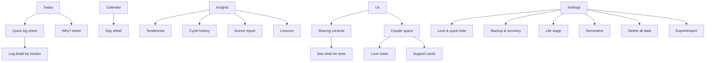

# UX and content specification (Step 7)

**Status:** Stage C draft, 2026-10-02. Wireframes are text sketches only; no visual design has been made yet. The app's name is a placeholder until it is approved (AP-20). Its working name is **"Tide"**, an original name chosen to avoid Flo branding (constitution rule 5).

## 1. Principles

1. **She is in control, and the screen shows it.** Sharing status is visible on her Today screen in a single line, such as "Sharing: 2 categories · Pause".
2. **Simple at a glance.** Each screen has one main question. Today answers "where am I and what's next?".
3. **Honest about uncertainty, without clutter.** Each prediction gets one short line, and a "Why?" sheet holds the details (§6).
4. **Her logs, not stereotypes.** Partner tips and insights come only from her own logs or her own requests.
5. **Warm, respectful, plain words.** No jargon without a glossary link. No guilt about logs she missed.

## 2. Two experiences and navigation

| Her app (owner) — bottom tabs | His app (partner) — bottom tabs |
|---|---|
| **Today** · **Calendar** · **＋ Log** (centre) · **Insights** · **Us** | **Today** (partner view) · **Calendar** (shared only) · **Us** (couple space) |
| Settings: gear on Today | Settings: gear on Today |

The role is chosen at onboarding: "I'm tracking my cycle" or "I'm the partner". A partner-mode app has no health-logging screens.



## 3. Key screens and flows

### 3.1 Onboarding (no account)

1. **Welcome:** "Private cycle tracking for you two. No account. Your data stays on your phones, encrypted."
2. **Install check.** If the app is not running from the Home Screen, show an illustrated "Share → Add to Home Screen → Open as Web App" guide (R4 S18), with "Continue in browser anyway" in small text. Data entered in Safari is **not** carried into the installed app (R4 S19), so the app says so.
3. **Role:** "I'm tracking my cycle" or "I'm the partner".
4. **Lock:**
   - Create a passphrase. A 4-word phrase is suggested; she can type her own of 10+ characters.
   - Then the **recovery code** screen: show the code, ask her to save it, and have her retype 4 characters to confirm.
5. **Optional Face ID** (only if FB-07 passed): "Unlock with Face ID".
6. **(Her) Basics:**
   - last period start (calendar picker; "I don't remember" allowed);
   - typical cycle length (stepper, "not sure");
   - typical period length;
   - contraception method (list, "none", "prefer not to say");
   - goal (track my cycle / avoid pregnancy / trying to conceive);
   - birth year (optional; used for FIGO age bands and perimenopause gating).
7. **(Her) Reminders:** "Remind me to log my period while I'm on it" (on), "Daily check-in" (time picker, off). Push needs a separate permission request, triggered by a tap later (R4 §3).
8. **Pair now or later.** Pairing is never required. Sharing is off until she turns categories on.
9. **First Today:** the first-cycle state (§5).

**His onboarding** is steps 1–5, then "Scan her pairing code", then the partner Today screen, which reads "Nothing shared yet — that's her choice."

### 3.2 Her Today

```text
┌──────────────────────────────────────┐
│ Tide                 🔒 Hide    ⚙︎    │
│ Cycle day 12                          │
│ Next period: around Oct 8             │
│   (Oct 4 – Oct 10)          Why? ›    │
│ ┌──────────────────────────────────┐  │
│ │ Pregnancy chance today: Medium   │  │
│ │ No day is "safe" without         │  │
│ │ contraception.          Why? ›   │  │
│ └──────────────────────────────────┘  │
│ [ ● Period started ]  [ ＋ Log today ]│
│ Logged today: Energy ▲ · Cramps        │
│ ─ Did you know? (card with source) ─  │
│ Sharing: 2 categories · Pause ›       │
│ Love note from him ♡ (if she enabled) │
└──────────────────────────────────────┘
```

- **Three-tap rule** (constitution rule 7):
  - period started = **1 tap**;
  - flow level = **2 taps** (＋ Log → Medium);
  - a symptom = **2 taps** (＋ Log → chip);
  - mood = **2 taps**.

  Each choice saves instantly, with an "Undo" toast. e2e test T-UX-01 checks the tap counts.
- **During a recorded period:** an extra prompt card "Still bleeding today? · Yes, light · Yes, medium · Yes, heavy · Stopped". This answers her request for period logging reminders.
- **Clinician-guidance cards** sit at the top only when triggered (A11). They have a severity colour plus an icon and text, so colour is never the only signal. EMERGENCY cards cannot be dismissed while the condition persists.

### 3.3 Quick log sheet and log detail

The sheet shows the trackers she pinned. The defaults are flow, symptoms, mood, desire, sex, discharge, energy, notes, and tests. Each tracker opens a chip grid built from the [enumerations](architecture.md#52-logging-enumerations-original-labels-every-value-is-versioned-in-srccontractsenumsts).

- **Sex log** (private): activity, protection, comfort, satisfaction, bleeding after. A note says: "Private. There's no way to share this in this version."
- **Desire** (none/low/medium/high) has a one-line helper: "Just for you, to notice your own patterns."
- **Heavy-bleeding details** appear only when flow is heavy or very heavy.
- **Customize trackers** in Settings: pin, hide or reorder.

### 3.4 Calendar

- **Month view by default; year view available.**
- **Day marks** never rely on colour alone:
  - logged period: filled drop;
  - assumed day: hatched;
  - predicted window: dotted outline;
  - core fertile days: small leaf; "Higher" days: double leaf;
  - logs present: dot;
  - spotting: hollow drop.
- **Tapping a day** opens the day detail. She can edit a past day, or mark "period started/didn't start here" or "exclude this cycle".
- **Legend** always reachable through the ⓘ button.

### 3.5 Insights

- **Your tendencies** (A12). Each metric shows one of four states:
  - TENDENCY, e.g. "Desire: tended to be higher around mid-cycle — seen in 3 of 3 cycles · 9 logged days";
  - NO_CLEAR_PATTERN: "No clear pattern — that's common";
  - INSUFFICIENT, with progress dots;
  - RECENTLY_CHANGED.

  A coverage line always shows, e.g. "Patterns only reflect days you logged (21 of 84)".
- **"When you've tended to feel like sex"** (F-118):

  ```text
  ┌──────────────────────────────────────┐
  │ When you've tended to feel like sex  │
  │ Around mid-cycle (3 of 3 cycles)     │
  │ This describes your past logs. It's  │
  │ not a prediction, and it never       │
  │ means yes. Mid-cycle is also when    │
  │ pregnancy is more likely.            │
  └──────────────────────────────────────┘
  ```
- **Cycle history:** lengths chart, period lengths, variability, labelled ranges with sources, and her prediction track record (A18).
- **Doctor report:** choose six cycles including the current one (default) or six months. A print preview offers "Share/Print → Save PDF".
- **Lessons:** the original library (§8).

### 3.6 Life stages

Settings → Life stage → choose a mode:
- **Pregnancy:** dating source (LMP, clinician due date, IVF transfer, conception date) and number of babies.
- **Leaving pregnancy:** the gentle exit flow asks "How did your pregnancy end?" with the options birth, loss, or prefer not to say → "ended". Copy for loss is reviewed for sensitivity. Nothing about a mode change is sent to the partner unless the `life_stage` category is on (CR-09).

### 3.7 Reminders

- A list of rules: period start window, "still bleeding?", daily symptom log, pill (P4), custom.
- **Delivery:** in-app always; push optional, as one daily generic notification at a time she chooses.
- **Preview line:** "Your lock screen will say: 'Time for your check-in.' Details appear after you unlock."

### 3.8 Sharing controls (found instantly: on Today and in the Us tab)

```text
┌──────────────────────────────────────┐
│ Sharing with Sam            [Pause all]│
│ Cycle overview            ● On   ›   │
│ Period prediction         ● On   ›   │
│ Fertility estimate        ○ Off  ›   │
│ When I've felt like sex   ○ Off  ›   │
│ Support requests          ● On   ›   │
│ Life stage                ○ Off  ›   │
│ Selected symptoms/moods   ○ Off  ›   │
│ Sharing from: Oct 2 (change)          │
│ [ See what Sam sees ]                 │
│ Stop sharing a category · Unpair      │
│ "Revoking stops future sharing. It    │
│  can't make him unsee what he saw."   │
└──────────────────────────────────────┘
```

- Turning a category on shows a **preview of exactly what he will see**, then a Confirm button.
- **Pause** takes one tap and asks no question.
- Each category screen has a "Stop sharing (revoke)" action that explains key rotation in plain words.
- A **consent history** lists pair, unpair, on, off, pause and revoke events with dates (private to her).

### 3.9 Couple space (Us tab; both write)

- **Timeline of entries:** dates, sex (couple-logged; private to the two of you), notes, love notes, support cards.
- **Add entry:** both partners can add. Only the author can edit or delete; the other person can "hide for me".
- **Her toggle on each entry:** "Use this in my insights" (off by default).
- **Love notes (F-117):**
  - he writes a note and can pick a date to show it;
  - she chooses the display mode in Settings: off, show on Today, or keep in a collection she opens;
  - notes are never triggered by her health data;
  - there are no read receipts.
- **Support cards (F-102):**
  - she taps a card, e.g. "Company tonight", "Practical help (snacks/heat pad)", "Some space", or custom text;
  - she sends it deliberately, and he sees it in his Us tab;
  - an optional generic push is sent only if she turned that on.

### 3.10 His partner view (Today)

```text
┌──────────────────────────────────────┐
│ Her cycle (shared by her)        ⚙︎   │
│ Day 12 · Follicular phase             │
│ Next period: around Oct 8 (Oct 4–10)  │
│ Pregnancy chance today: Medium        │
│ No day is "safe" without contraception│
│ She asked for: Practical help · Oct 2 │
│ Paused categories show "Paused by her"│
│ Tips from what she shared ›           │
└──────────────────────────────────────┘
```

- **Tips** are built only from her shared projections and her support cards. Example: "She asked for practical help today."
- Tips are **never** generic statements about "women on their period".
- The view is read-only, with no way to edit her data.

### 3.11 Settings (privacy and backup)

- **Lock:** timeout (immediately / 1 / 5 / 15 min), Face ID, change passphrase, quick-hide gesture (double-tap the 🔒 Hide button).
- **Backup and recovery:**
  - last backup date;
  - "Back up now" (Share sheet);
  - "Test restore";
  - "Relay backup" (opt-in);
  - recovery code status;
  - `persist()` status ("Storage protection: granted/not granted").
- **Sync:** relay on/off, "Export sync file" / "Import sync file" (manual mode), conflict copies.
- **Data:** export JSON/CSV, import, "Delete all my data" (type DELETE to confirm; shows what cannot be deleted).
- **About:** engine version, sources list, "This app is informational, not medical advice and not birth control."

## 4. Quick-hide (F-113)

Tapping "🔒 Hide" (or the background timer firing) does three things at once:
- shows a neutral screen with the app name and a "Tap to unlock" prompt;
- drops all keys from memory;
- clears any decrypted DOM.

Returning means unlocking. Nothing is deleted. The app does not pretend to be a different app, so there is no decoy or fake calculator.

## 5. Empty states and the first cycle

| State | Shown |
|---|---|
| No period logged | "Log the first day of your period to start predictions." Buttons: "Period started today" and "It started on… (pick date)" |
| One start logged, no completed cycle | Prediction from her typical length or 28, shown as a wide window with the line "Predictions get more personal after a few cycles. Until then the window is wider." |
| Fertility with fewer than 3 cycles | Wide "possible" band plus the line "Based on the calendar only — less certain until you've tracked longer." |
| Tendencies | "After 3 cycles of logging, you'll see your own patterns here. Logged so far: ● ○ ○" |
| Partner, nothing shared | "Nothing shared yet. Sharing is entirely her choice." There is **no** request button (CR-17) |

## 6. Uncertainty and disclaimers without clutter

- **One line on the screen, depth on request.** Predictions always show a range ("around Oct 8, Oct 4–10"). "Why?" opens a sheet with:
  - the method (e.g. "your last 7 cycles, weighted toward recent ones");
  - what widened the window;
  - the version;
  - the sources.
- **The fertility "no safe days" line** is permanent on every fertility surface, in compact form: "No day is 'safe' without contraception." The full disclaimer sits behind ⓘ.
- **One app-wide disclaimer** at onboarding and in About: informational only, not a diagnosis, not birth control. Medical cards carry their own one-line source attribution.
- **Never** use numbers for pregnancy chance (A5), "safe" or "infertile", or "you have <condition>".

## 7. Tone, copy rules and accessibility

**Tone.** Warm, direct, second person, no medical jargon without a tooltip. Examples:
- "Your period might be a few days late. That's common, but if you might be pregnant, a test can help. When to test ›"
- For pregnancy loss: "We're so sorry. Take whatever time you need. Tracking will restart gently whenever you're ready."

**Banned phrases.** Lint checks every UI and content string (T-CON-14, T-UX-03): `safe day`, `safe to have sex`, `can't get pregnant`, `cannot get pregnant`, `no chance`, `zero chance`, `0%`, `infertile day`, `she wants`, `in the mood today`, `ready for sex`, `good day for sex`, `best day for sex`, `guarantee`, `you have PCOS|endometriosis|fibroids`, `diagnosis:`.

**Accessibility** targets WCAG 2.2 AA (https://www.w3.org/TR/WCAG22/, accessed 2026-10-02; the 2.5.8 "at least 24 by 24 CSS pixels" target size is Documented, high):

| Requirement | Design rule |
|---|---|
| Touch targets | ≥24×24 CSS px minimum (WCAG 2.5.8). Our design target is **44×44** |
| Contrast | 4.5:1 for text; 3:1 for UI elements, in both light and dark mode |
| Text size | Respects iOS text-size settings through rem/`-apple-system-body` |
| Screen reader | VoiceOver labels on every chip and calendar day, e.g. "October 4, predicted period window, logged spotting" |
| Motion | Honours `prefers-reduced-motion` |
| Visible focus | Required |
| Colour | Never the only signal |
| Forms | Labelled forms; errors announced |

Automated checks: axe in Playwright. Manual checks: VoiceOver smoke tests on the real phones at each phase demo.

## 8. Original educational content plan

**Format** (`src/content/cards/<id>.md` plus front-matter):
- `id`, `title`, `body` (≤150 words, about grade-8 reading level);
- `claims[]`, where each claim maps to a `sources[]` entry {publisher, title, url, accessed};
- `modes`, `phaseTags`, `symptomTags`;
- `lastReviewed`, `reviewer` (verify task id).

**Rules:**
- Original wording only. **No Flo text, structure, images or video** (constitution rule 5).
- Approved sources: ACOG, NHS, NICE, CDC, WHO, ASRM, ESHRE, peer-reviewed literature.

**Fact-check process (required):**
1. A Luna writer drafts the card, with the sources attached.
2. An **Opus medical-content fact-checker** verifies every claim against the cited page, checks currency (version and date) and safety wording, and confirms the copy lint passes (verify task).
3. Cards fail if a source is dead, outdated or contradictory.
4. Cards are re-reviewed at each phase gate where they have changed, and every 12 months.

**Topics.** Mapped to Flo's content areas (R1 §1 Content library), plus sexual wellbeing. The sources named are *starting candidates*: the content task must retrieve them and note access dates. Topics marked † already have URLs in the research reports.

| Area (Flo equivalent) | Initial topics | Candidate sources | Phase |
|---|---|---|---|
| Cycle basics | What a cycle is; phases; why cycles vary; spotting vs period | ACOG FAQ095†, FIGO 2023†, Bull 2019† | P1 |
| Predictions and uncertainty | How the app predicts; why windows; "not birth control" | Wilcox 2000†, ASRM 2022† | P1 |
| Period health | Heavy bleeding — when to get help; period pain; when to see a clinician | NHS heavy periods†, NICE NG88†, ACOG FAQ095†, ESHRE 2022† | P1 |
| Pregnancy tests and late periods | When to test; what a faint line means; what to do next | ACOG/NHS pregnancy-test pages (to retrieve) | P1 core, P4 full |
| Contraception | Methods overview; missed pills; emergency contraception; condoms | WHO/JHU Family Planning Handbook†, CDC contraception pages (to retrieve), NHS contraception (to retrieve) | P1 core, P4 full |
| STI prevention and testing | Barrier methods; testing schedules; talking about testing | CDC STI pages, WHO (to retrieve) | P1 core |
| Sexual wellbeing | Consent and communication; desire varies; comfort and pain during sex (when to seek help); pleasure basics | WHO sexual health definitions, ACOG painful-sex FAQ (to retrieve), ESHRE 2022† (deep dyspareunia) | P1 core (consent), P5 |
| Fertility and TTC | The fertile window; LH tests; BBT; mucus | ASRM 2022†, WHO/JHU handbook†, Wilcox 1995† | P3/P4 |
| PMS and mood | PMS vs PMDD (no self-diagnosis); tracking for 2–3 months | ACOG FAQ057†, Romans 2012† | P3 |
| Pregnancy | Dating; weekly development (original text); antenatal care schedule; warning signs | ACOG CO700†, NICE NG201†, NHS ectopic† | P4 |
| Postpartum and pregnancy loss | Return of periods; contraception after birth; support after loss | NHS/NICE (to retrieve) | P4 |
| Perimenopause | What it is; symptoms; when to see a clinician; under-40 changes | NICE NG23†, STRAW+10 review† | P4 |
| Conditions to discuss | PCOS; endometriosis; fibroids (pattern explanations, not diagnosis) | PCOS 2023†, ESHRE 2022†, NICE NG88† | P5 |
| Sleep, stress, activity, nutrition | Short practical cards linked to symptoms | NHS/WHO (to retrieve) | P5 |
| Crisis support | Mood crisis resources | National crisis line for her country (**source gap**, W-11) | P1 |

**P1 core card set** (15 cards, task `p1-content-core`):
- `cycle-basics`
- `how-predictions-work`
- `fertile-window-uncertainty`
- `not-birth-control`
- `pregnancy-possible-any-day`
- `when-to-test`
- `emergency-contraception-basics`
- `condoms-and-sti-prevention`
- `heavy-bleeding-when-to-get-help`
- `period-pain-when-to-get-help`
- `spotting-vs-period`
- `consent-and-communication`
- `desire-varies`
- `how-sharing-works`
- `your-data-and-backups`
